### PAYable ECR Client

ECR Client - [payable.github.io/ecr-sdks/ecr-client-java/platforms/windows-xp-32](https://payable.github.io/ecr-sdks/ecr-client-java/platforms/windows-xp-32)

ECR Client is the software which can help the POS/Host system to accept the payment requests using HTTP through TCP/IP port internally and externally.

### Use case

#### Problem: 

The POS/Host system was developed using a technology which does not support any WebSocket (ws://) protocols or so older.

#### Solution:

Most of the Point of sale systems support HTTP protocols to communicate with servers or any other service providers, so if the Point of sale system supports
HTTP protocols means that it can support PAYable ECR Client too.

Since the POS system does not support WebSocket protocol, it can send HTTP requests to the installed ECR Client software, 
and the POS should expose an internal PORT to receive the callbacks from the ECR Client when the terminal responds.

### Setup and installation:

#### Download ECR Client - [setup-win32.exe](https://github.com/payable/ecr-sdks/raw/master/ecr-client-java/platforms/windows-xp-32/setup-win32.exe)

#### 1. Install ECR Client software in the PC.

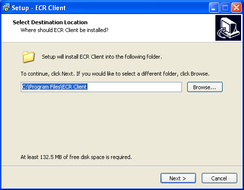

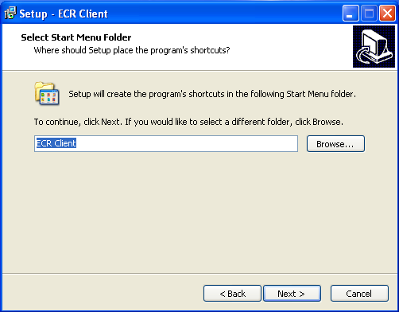

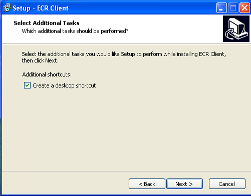

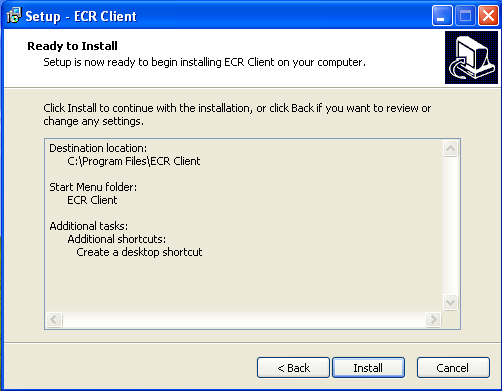

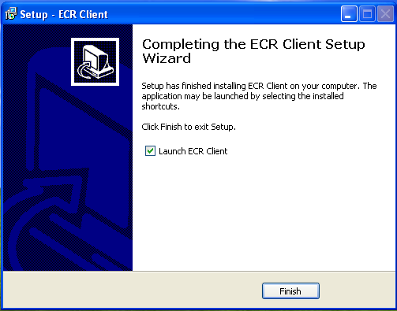

#### Click Unblock/Allow if Windows Firewall ask to grant access to internet.

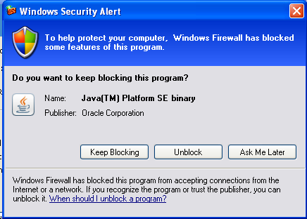

#### 2. Please follow this step if you want to connect the terminal using USB port (for LAN/IP connections this step can be ignored).

2.1 Connect the WPOS terminal with USB cable.

2.2 Find AdbDemo application on the home screen of the WPOS terminal, if not please ask PAYable to grant ADB access to the terminal.

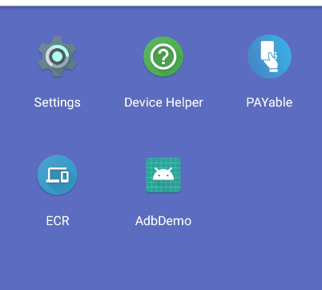

2.3 Tap Enable adb button on the AdbDemo application.

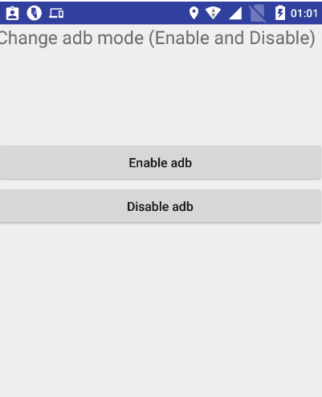

2.4 Install drivers if the device is shown as unknown on the system (Device Manager). 

Many latest Windows versions take the drivers automatically and install, but you need to manually install for some old versions such as Windows XP.

The below window will appear once you connected the terminal with USB if the drivers are not installed, then follow the below steps.

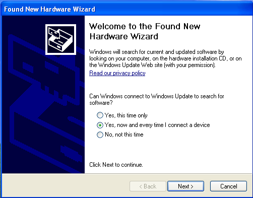

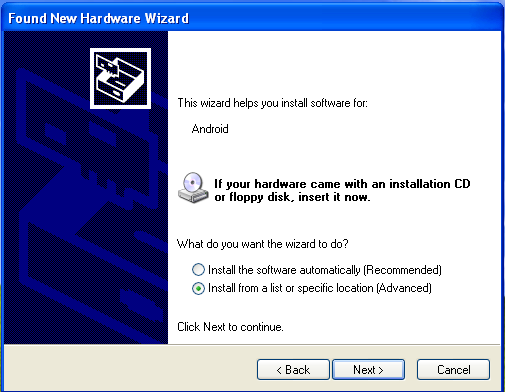

Please choose: `C:\Program Files\ECR Client\sys\usb_driver_xp\32-bit`, choose 32/64 bit as per your system configuration.

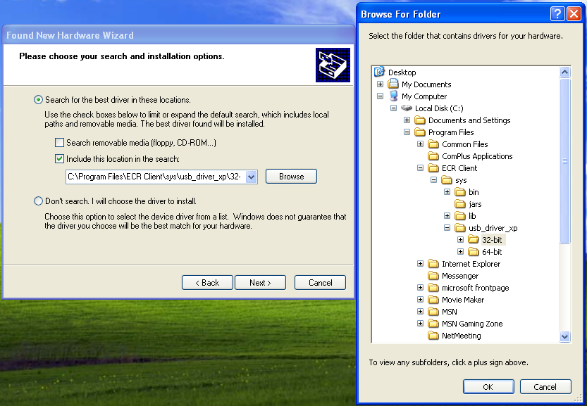

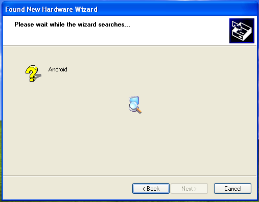

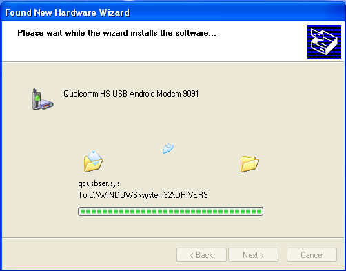

Once you installed all drivers properly, you can see the device is recognized by Windows.

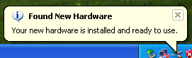

#### 3. Connect the terminal using the ECR Client user interface.

3.1 Enter the terminal address as an IP address for LAN, serial number for WAN or 127.0.0.1 for USB connection.

3.2 Enter a unique POS name for the current Point of sale system

3.3 Click Connect button and wait for the response from the terminal.

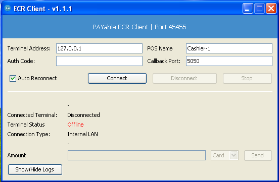

The status will be shown as Online, and the terminal's serial number will be sent through terminal at the successful connection response.

You can close this window, and it will be minimized and will be auto connecting when the device disconnect and connect at the startup.

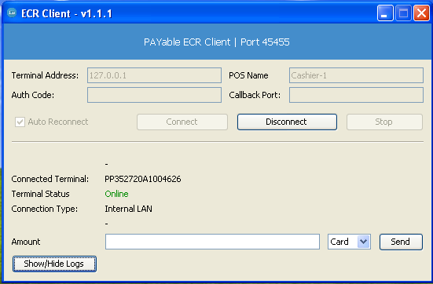

Now ECR Client is successfully installed and connected with PAYable terminal.

#### 4. Sending Payment request.

4.1 Send JSON HTTP POST request to 45455 port of ECR Client from your project.

Request:

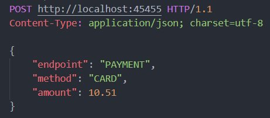

Response:

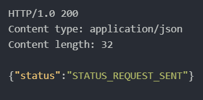

4.2 Once the connected terminal respond to the ECR Client, it will send the response back to the callback PORT provided using HTTP POST method.

All the logs will be traced form Logs.

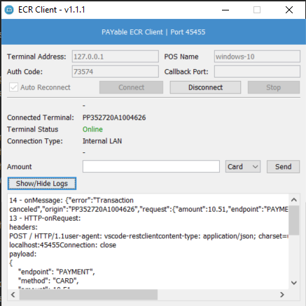
